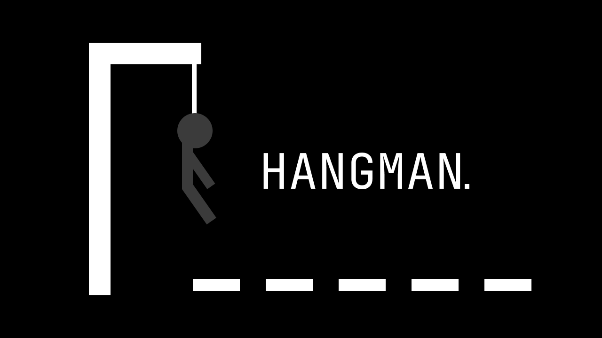

# Hangman Game in C



This repository contains a simple implementation of the Hangman game in C. The game can be played by one player against the computer or by two players. The player tries to guess a word based on hints and letter guesses.

## How to Play

### Single Player Mode

1. Compile the game using the command `gcc -o hangman main.c`.
2. Follow the instructions to choose the game mode: "1" for one player.
3. You'll receive a hint and a set of dashes representing the hidden word.
4. You have a limited number of attempts to guess the word.
5. Enter letters to try to guess the word.
6. If you guess the word, you win the game. Otherwise, you lose.

### Two Player Mode

1. Compile the game using the command `gcc -o hangman main.c`.
2. Follow the instructions to choose the game mode: "2" for two players.
3. The first player provides a hint and a word to the second player.
4. The second player receives the hints and the dashes representing the hidden word.
5. The second player has a limited number of attempts to guess the word.
6. Enter letters to try to guess the word.
7. If the second player guesses the word, they win the game. Otherwise, the first player wins.

## Features

- The game uses predefined hints and words stored in the code.
- In single player mode, the number of attempts is equal to the word's length plus two.
- The game recognizes both uppercase and lowercase letters as input.

## Customization

You can customize the game by adding your own words and hints to the code. Simply update the `dicas` and `palavras` lists in the `main.c` file and make sure the indices match.

```c
char dicas[] = "YOUR_HINT_HERE";
char palavras[] = "YOUR_WORD_HERE";
```

## Requirements

- GCC compiler to compile the C code.

## Contributions

Contributions for game improvements are welcome. Feel free to fork the repository, implement new features, fix bugs, and submit pull requests.

## License

This Hangman game in C is distributed under the GNU license. Refer to the LICENSE file for more details.

Enjoy playing the Hangman Game!